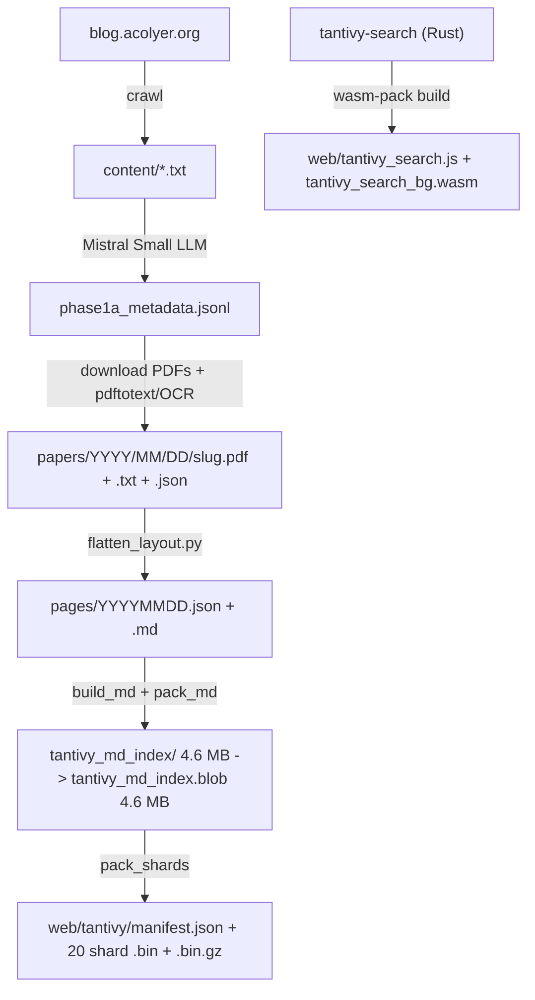
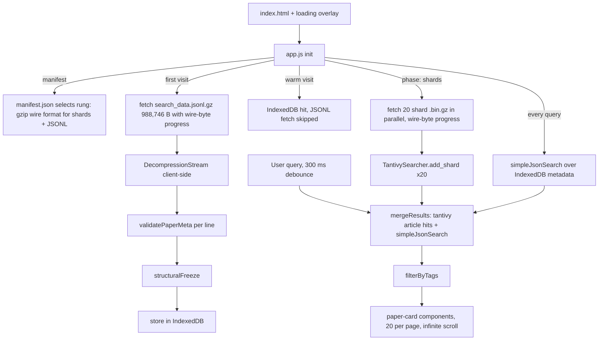

# The Morning Paper Archive

# https://simbo1905.github.io/the-morning-paper-archive/

An internet archive of [blog.acolyer.org](https://blog.acolyer.org) — Adrian Colyer's "The Morning Paper," a random walk through Computer Science research. The blog went offline for several months in 2017; this project preserves all 995 articles in a searchable, client-side application hosted on GitHub Pages at <https://simbo1905.github.io/the-morning-paper-archive/>.

## What is it?

A static site, no backend. On first visit the browser downloads a 3,247,363-byte JSONL file containing metadata for all 995 papers (988,746 bytes gzip on the wire, decompressed client-side via `DecompressionStream`) and the Tantivy article index shipped as 20 packed shards (6,908,739 bytes raw, 5,378,461 bytes gzip on the wire), and runs all search queries locally. Queries hit two engines: Tantivy BM25 over the full article text (in WASM) merged with a simple string-contains search over the paper metadata. A full-viewport loading overlay with a wire-byte progress bar keeps the page hidden until everything is loaded. No server round-trips after the initial page load.

## Architecture

### Build time flow



| Step | Description |
|------|-------------|
| 1 | Crawl blog.acolyer.org to `content/*.txt` |
| 2 | Mistral Small LLM extracts metadata to `phase1a_metadata.jsonl` |
| 3 | Download paper PDFs, extract text via `pdftotext` or Tesseract OCR |
| 4 | `flatten_layout.py` produces `pages/YYYYMMDD.json` and `pages/YYYYMMDD.md` |
| 5 | `tantivy-native` `build_md` builds the article index (4.6 MB on disk); `pack_md` packs it into a single 4,620,037-byte blob |
| 6 | `pack_shards` writes the 20-shard pack: raw `.bin` + gzip `.bin.gz` + `manifest.json` (gzip rung) + `manifest.raw.json` (raw-rung test fixture) |
| 7 | `wasm-pack` compiles `tantivy-search` (blob loader + merged searcher) to WASM |

### Runtime flow



| Step | Description |
|------|-------------|
| 1 | Loading overlay covers the page immediately; progress bar tracks wire bytes |
| 2 | `manifest.json` is read once; it selects the shard encoding (gzip) and the JSONL wire file |
| 3 | First visit: `search_data.jsonl.gz` fetched, decompressed client-side; warm visits skip the fetch (IndexedDB) |
| 4 | Each line validated with `validatePaperMeta`, then deep-frozen |
| 5 | Valid papers stored in IndexedDB, cached across visits |
| 6 | 20 shard `.bin.gz` fetched in parallel, decompressed, unpacked into `TantivySearcher` |
| 7 | Every query runs `simpleJsonSearch` plus Tantivy article search; results merged by date |
| 8 | Tag post-filtering applied to the merged, cached results |
| 9 | Results rendered as `paper-card` Web Components, 20 per page with infinite scroll |

### Data pipeline

Six-phase Python pipeline that crawls the blog, extracts metadata via LLM, downloads papers, extracts text, and assembles JTD-compliant JSON.

| Phase | Script | What it does |
|-------|--------|-------------|
| 1a | `phase1a_extract_metadata.py` | Reads blog post text, sends to Mistral Small for structured metadata extraction (title, authors, year, venue, URL, summary, topics, tags) |
| 1b | `phase1b_fetch_papers.py` | Downloads paper PDFs from extracted URLs |
| 2 | `phase2_download_from_search.py` | Retries missing papers via Tavily web search |
| 4 | `phase4_extract_text.py` | `pdftotext` with fallback to `pdfimages` + Tesseract OCR |
| 5 | `phase5_extract_figures.py` | Extracts figure metadata from PDFs |
| 6 | `phase6_build_json.py` | Merges metadata + abstract + figures into final JTD-compliant JSON per paper |
| — | `flatten_layout.py` | Flattens to `pages/YYYYMMDD.json` + `pages/YYYYMMDD.md` |

All scripts use `#!/usr/bin/env -S uv -S python3` shebangs and have resume capability (skip-if-exists, progress JSON). `papers/` is the pipeline working directory (downloaded PDFs, extracted text, figures); it is not tracked in git.

## Search

Search = two engines merged (`web/src/merge.js`), deduped by paper date, source-annotated. The JSON engine always runs; the Tantivy engine covers the full article body.

### Article search: Tantivy in WASM

The full-article search engine is Tantivy, compiled to WASM via `wasm-bindgen`. The article index is built once by `wasm-test/tantivy-native` (native Rust, real filesystem) and shipped as 20 packed shard `.bin` blobs; the browser-side `tantivy-search` crate unpacks blobs into a `RamDirectory` and opens the index, so nothing ever touches a filesystem at runtime.

**Index pack** (`wasm-test/tantivy-native`):

1. `build_md.rs` builds a Tantivy index over the 995 cleaned article markdown docs (fields: `date` and `slug` string-stored, `blog_title` text-stored, `body` text indexed NOT stored) into `tantivy_md_index/` (4.6 MB disk)
2. `pack_md.rs` packs the index directory into a single blob, `tantivy_md_index.blob` (4,620,037 bytes), in the shared manifest-blob format: `u32 LE manifest_len | "filename:offset:len" lines | concatenated file bytes`
3. `pack_shards.rs` builds 20 chronological shards (50 docs each; shard-19 holds the 45 newest) in memory per shard and packs each into the same blob format, writing both rungs to `web/tantivy/`

**Runtime search** (`wasm-test/tantivy-search`, `TantivySearcher`):

1. `add_shard(bytes)` per shard: unpack blob into a `RamDirectory`, open the Tantivy index. Lock files (`.tantivy-meta.lock`, `.tantivy-writer.lock`) are never materialized — the reader acquires the meta lock via `open_write`, which fails `FileAlreadyExists` if a packed 0-byte lock file were present
2. `search(q, limit)`: BM25 merged across all shards, conjunction-by-default (matches the Whoosh MultifieldParser AND semantics)
3. `search_fuzzy(q, limit, max_dist)`: `FuzzyTermQuery` union over the indexed fields, Levenshtein distance ~2 (`transposition_cost_one = true`)
4. `num_docs()`: 995
5. Returns JSON `[{date, score, shardIndex}]`; enrichment against paper metadata happens in the frontend (`web/src/search.js`)

### Metadata search: simple JSON contains

`simpleJsonSearch` is a plain string-contains search over the IndexedDB paper metadata (title, summary, abstract, venue, authors, topics, tags). It is not a fallback: it runs on every query and is merged with the Tantivy article hits, so metadata-only matches (e.g. a venue or author name with no occurrence in the article body) are always findable.

**Merged semantics** (`web/src/merge.js`): results from both engines are deduped by date, score is the max of the two engines, and each result is annotated `source: "article" | "json" | "both"`. Output sorted by score desc, ties break to the newer date. An empty query is a listing of all 995 papers, newest first — not a search.

**No hidden fallback**: the old `simple_search.js` / `simple_search_bg.wasm` WASM search is deleted from the site. If Tantivy fails to initialise, the UI logs the failure loudly (`console.warn`) and the search-mode indicator honestly shows "JSON only" — no silent mode switching, no fake results.

## Wire format and sizes

Assets are served as plain `application/octet-stream` — there is no `Content-Encoding` HTTP trick. Gzip payloads are decompressed client-side via the native `DecompressionStream`; the manifest (`web/tantivy/manifest.json`) selects the rung, so both rungs ship from the same packer. `DecompressionStream` is a hard requirement on a gzip rung: a browser without it gets an honest overlay error (`browser too old for gzip index — needs DecompressionStream`), never a silent raw fallback. `manifest.raw.json` exists as the raw-rung test fixture only.

| Artifact | Raw bytes | Gzip bytes (wire) | Ratio |
|---|---:|---:|---:|
| shard-00 … shard-19 (20 shards, 995 docs) | 6,908,739 | 5,378,461 | 0.779 |
| `search_data.jsonl` | 3,247,363 | 988,746 | 0.304 |
| **Total initial payload (cold visit)** | **10,156,102** | **6,367,207** | **0.627** |

Other shipped binaries:

| Artifact | Bytes |
|---|---:|
| `web/tantivy_search_bg.wasm` | 2,170,326 |
| `web/tantivy_search.js` (wasm-bindgen glue) | 10,305 |

## Loading

`index.html` shows a full-viewport overlay immediately; page content is hidden until everything is loaded. `app.js` drives phases (shard fetch + WASM init, JSONL fetch, IndexedDB store) through `ProgressReporter` with `fetchWithProgress` (ReadableStream byte-level progress), per-shard and per-phase console timing logs, and a wire-byte progress bar that never jumps backwards. On failure the overlay shows the error — nothing half-loaded is ever revealed.

## JSON validation

Validation happens at every boundary where data crosses from one system to another.

**Build time** (Python): `phase6_build_json.py` produces JSON conforming to a JTD (JSON Type Definition, RFC 8927) schema for `paper-meta` (`web/schemas/paper-meta.jtd.json`). The schema defines 17 required fields with specific types (strings, arrays, `int32`, booleans) plus optional `figures`.

**Runtime** (browser): `web/src/validate.js` runs a hand-written validator that checks all 17 required fields exist and verifies types on the critical ones (`date`/`slug`/`paper_title` are strings, `paper_authors`/`topics`/`tags` are arrays, `paper_year` is a number, `ocr_used` is a nullable boolean). Invalid records are silently skipped during `loadData()`. Validated objects are deep-frozen via `structuralFreeze()` to prevent mutation after storage.

**Type definitions**: `web/src/types.js` defines `PaperMeta` and `SearchResult` as JSDoc `@typedef` annotations, matching the JTD schema fields. These provide editor autocomplete and `tsc --noEmit` type checking (`npm run check` in `web/`) without any transpiler or build step.

## Frontend architecture

No framework, no build step, no transpiler, no bundler. Pure ES modules + Web Components + JSDoc.

Entry point: `index.html` loads `web/src/app.js` and `web/src/components.js` as ES modules. `.nojekyll` disables Jekyll processing on GitHub Pages.

| File | Responsibility |
|------|---------------|
| `app.js` | SPA orchestrator: loading phases + progress overlay, data loading, search, routing, infinite scroll |
| `search.js` | Search abstraction: Tantivy article search merged with simpleJsonSearch over IndexedDB; manifest-driven rung selection |
| `merge.js` | Pure merge of JSON and article hit lists (dedupe by date, max score, source annotation) |
| `progress.js` | fetchWithProgress (ReadableStream byte progress) + ProgressReporter (bytes to percent) |
| `decompress.js` | Native `DecompressionStream` gzip decompression; throws `DecompressionUnsupported` when unavailable |
| `db.js` | IndexedDB layer (papers keyed by date, cached across visits) |
| `validate.js` | JTD-style runtime validator + structuralFreeze |
| `types.js` | JSDoc typedefs (PaperMeta, SearchResult, Figure) |
| `components.js` | Three Web Components (light-DOM, no Shadow DOM) |
| `styles.css` | Loading overlay, dark mode, responsive layout |
| `src-tests.html` | Vanilla test runner (plain ES module asserts, no framework) |

**Web Components** (all light-DOM, native semantic HTML):

| Element | Purpose |
|---------|---------|
| `<paper-card>` | Paper summary, expandable abstract via `<details>`, tag pills, links to PDF/original/blog post |
| `<tag-pill>` | Clickable removable tag filter chip |
| `<blog-post>` | Fetches `pages/YYYYMMDD.md`, renders with a regex-based markdown-to-HTML converter |

**Search flow**: every query runs `simpleJsonSearch` (string `.includes()` over concatenated metadata fields) and, when the article index is loaded, Tantivy BM25 (or Tantivy fuzzy when the Fuzzy toggle is on, distance 2). The two hit lists are merged by `merge.js` and cached in `sessionStorage` for tag post-filtering without re-querying.

**Data persistence**: Paper metadata is stored in IndexedDB on first visit. Subsequent visits skip the JSONL fetch entirely; only the shard pack is re-fetched (5,378,461 bytes gzip) to rebuild the in-memory article index.

**Routing**: Hash-based (`#/blog/YYYYMMDD`) for deep links to individual blog posts.

**Word cloud**: ECharts + echarts-wordcloud loaded from CDN. Clicking a tag in the cloud adds it as a filter.

## QA gates

The repo runs a TDD-style CI-lite locally. Every article-search claim is gated against the Whoosh oracle battery, natively and in-browser.

### `make test`

| Check | Result |
|---|---|
| `scripts/test_corpus_clean.py` | `OK: 995 lines, 995 unique dates, 0 null years, 0 dupes, pages=995` |
| `scripts/test_whoosh_oracle.py` | 8 PASS (snapshot audit, pages corpus, md corpus, default battery, build report, ground truth) |
| `cargo test` (`wasm-test/tantivy-native`) | `battery_disk_vs_blob_same_results`, `blob_round_trip`, `shard_pack_round_trip` — ok (3/3) |
| `cargo test` (`wasm-test/tantivy-search`) | `searcher_core_public_api_matches_oracle` — ok (1/1) |

### `make oracle`

`scripts/whoosh_oracle.py` (uv shebang, PEP 723 `whoosh-reloaded`) runs `build --md` + `battery --md`: 995 records found, 995 indexed, 0 rejected, Whoosh index 17,336,750 bytes. Battery counts (total hits, no limit) — the ground-truth bar:

| Query | Oracle hits |
|---|---:|
| `blockchai` | 0 |
| `quantum blockchain` | 2 |
| `consensus` | 109 |
| `consensuz~2` (fuzzy) | 111 |
| `paxos consensus` | 37 |
| `distributed transactions` | 126 |
| `compiler optimization` | 13 |

Tantivy == oracle 7/7, natively and in-browser (`web/src-tests.html`, `web/tantivy-test.html`).

### `web/src-tests.html`

Browser suite over the pure modules + full integration (IndexedDB bootstrap, WASM init, oracle battery, empty-query listing): 28/28 PASS on the gzip rung, 27/27 on the raw rung.

### Measured timings

Representative measured values (Apple Silicon host, release builds; per-run values vary):

| Stage | Measured |
|---|---|
| Native battery, 7 queries, disk mmap | 1.95 ms total |
| Native battery, 7 queries, RAM blob | 1.87 ms total |
| Index build, 995 docs, 1 commit | 337 ms |
| Blob pack (4.62 MB) | 0.7 ms |
| Browser: fetch 20 shards (localhost, raw rung) | 41 ms |
| Browser: WASM init (unpack + index open, 995 docs) | 6 ms |

## Repository layout

| Path | Description |
|------|-------------|
| `index.html` | Entry point (GitHub Pages SPA) |
| `.nojekyll` | Disables Jekyll on GitHub Pages |
| `pages/` | 995 `YYYYMMDD.json` + 995 `YYYYMMDD.md` files (served statically) |
| `content/` | 996 crawled blog post text files |
| `papers/` | Pipeline working directory: downloaded PDFs, extracted text, figures (not tracked in git) |
| `phase1a_metadata.jsonl` | 995 LLM-extracted metadata records |
| `scripts/` | Python data pipeline (phases 1–6) + Whoosh oracle + test scripts |
| `wasm-test/search_data.jsonl` | 995 docs as JSONL, 3,247,363 bytes (the metadata source for IndexedDB) |
| `wasm-test/search_data.jsonl.gz` | Gzip rung of the JSONL, 988,746 bytes |
| `wasm-test/tantivy-native/` | Native Rust crate: builds the Tantivy md-article index, packs it as a single blob and as 20 shards |
| `wasm-test/tantivy-search/` | Rust crate compiled to WASM: blob loader + merged searcher |
| `wasm-test/simple-search/` | Superseded hand-rolled BM25 Rust crate (kept as history; not on the site) |
| `wasm-test/simple-search-test/` | Superseded native test harness for the hand-rolled crate |
| `wasm-test/simple_search.js` / `.wasm` | Legacy WASM artifacts of the superseded engine (not loaded by the site) |
| `wasm-test/seekstorm-native/` | Abandoned SeekStorm evaluation crate |
| `wasm-test/tantivy-native/tantivy_index.blob` | Abandoned 1,957,372-byte metadata-field index (real, loadable; superseded corpus design) |
| `web/tantivy/` | `manifest.json` + `manifest.raw.json` + 20 shard `.bin` (raw) + `.bin.gz` (wire) |
| `web/tantivy_search.js` | wasm-bindgen generated JS glue for tantivy-search |
| `web/tantivy_search_bg.wasm` | Compiled WASM binary for tantivy-search |
| `web/nginx.local.conf.in` | Template for the local dev nginx config (Makefile substitutes ROOT/PORT/PID/LOG) |
| `web/src/` | Frontend source (vanilla JS + JSDoc) |
| `web/src-tests.html` | Browser test runner for the pure modules + battery |
| `web/tantivy-test.html` | Standalone browser battery page for the WASM searcher |

## Local serving

```bash
make serve     # nginx on http://127.0.0.1:8080 (pidfile .tmp/nginx.pid)
make stop      # kill the nginx master, remove the pidfile
make status    # running / not running
make restart   # stop + serve
```

The config is generated by the Makefile from `web/nginx.local.conf.in` into `.tmp/nginx.local.conf` (root at the repo, `application/octet-stream` for `bin`/`gz`, `expires -1` for the dev loop). Ad-hoc servers are not used.

## Building from source

### Tantivy article index + WASM searcher

```bash
cd wasm-test/tantivy-native
cargo run --release --bin build_md    # build tantivy_md_index/ (995 docs)
cargo run --release --bin pack_md     # single blob: tantivy_md_index.blob
cargo run --release --bin pack_shards # web/tantivy/: manifest.json + 20 .bin + .bin.gz + manifest.raw.json
cd ../tantivy-search && wasm-pack build --target web --release
cp pkg/tantivy_search.js ../../web/
cp pkg/tantivy_search_bg.wasm ../../web/
```

`pack_shards` output is not byte-stable across runs (tantivy serialization nondeterminism); the QA battery verifies content correctness instead.

### Search data (JSONL)

```bash
# Concatenate all pages/*.json into one JSONL file
for f in pages/*.json; do cat "$f"; echo; done > wasm-test/search_data.jsonl
```

### Data pipeline

```bash
python3 scripts/phase1a_extract_metadata.py   # LLM metadata extraction
python3 scripts/phase1b_fetch_papers.py       # PDF download
python3 scripts/phase2_download_from_search.py # retry missing via web search
python3 scripts/phase4_extract_text.py        # pdftotext/OCR
python3 scripts/phase5_extract_figures.py     # figure extraction
python3 scripts/phase6_build_json.py          # final JTD-compliant JSON
python3 scripts/flatten_layout.py             # flatten to pages/
```

## Deploy

`git push` to `main`. GitHub Pages serves the static files directly from the repo root (`https://simbo1905.github.io/the-morning-paper-archive/`). No build step, no CI, no backend.

## License

Data is from [blog.acolyer.org](https://blog.acolyer.org) by Adrian Colyer. Paper PDFs belong to their respective copyright holders.
