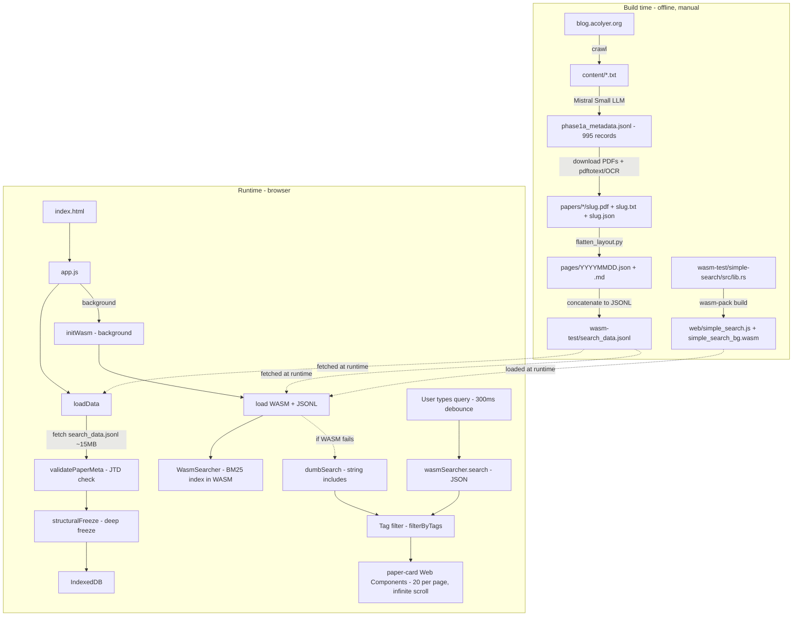

# The Morning Paper Archive

An internet archive of [blog.acolyer.org](https://blog.acolyer.org) — Adrian Colyer's "The Morning Paper," a random walk through Computer Science research. The blog went offline for several months in 2017; this project preserves all 995 articles in a searchable, client-side application hosted on GitHub Pages.

## What it is

A static site, no backend. You open it in a browser, it downloads a ~15 MB JSONL file containing metadata for all 995 papers, builds a BM25 inverted index in WebAssembly, and runs all search queries locally. No server round-trips after the initial page load.

## Architecture

### Build time and runtime flow



### Step details

| Step | Description |
|------|-------------|
| 1 | Crawl blog.acolyer.org to content/*.txt |
| 2 | Mistral Small LLM extracts metadata to phase1a_metadata.jsonl |
| 3 | Download paper PDFs, extract text via pdftotext or Tesseract OCR |
| 4 | flatten_layout.py produces pages/YYYYMMDD.json and .md |
| 5 | Concatenate all pages/*.json into search_data.jsonl |
| 6 | wasm-pack compiles Rust BM25 index to WASM |
| 7 | Browser fetches search_data.jsonl (~15 MB) |
| 8 | Each line validated with validatePaperMeta, then deep-frozen |
| 9 | Valid papers stored in IndexedDB, cached across visits |
| 10 | WASM module loaded in background, builds BM25 index from JSONL |
| 11 | User query sent to WASM search, falls back to string-contains if WASM unavailable |
| 12 | Tag post-filtering applied to cached search results |
| 13 | Results rendered as paper-card Web Components, 20 per page with infinite scroll |

### Data pipeline

Six-phase Python pipeline that crawls the blog, extracts metadata via LLM, downloads papers, extracts text, and assembles JTD-compliant JSON.

| Phase | Script | What it does |
|-------|--------|-------------|
| 1a | `phase1a_extract_metadata.py` | Reads blog post text, sends to Mistral Small for structured metadata extraction (title, authors, year, venue, URL, summary, topics, tags) |
| 1b | `phase2b_fetch_papers.py` | Downloads paper PDFs from extracted URLs |
| 2 | `phase2_download_from_search.py` | Retries missing papers via Tavily web search |
| 4 | `phase4_extract_text.py` | `pdftotext` with fallback to `pdfimages` + Tesseract OCR |
| 5 | `phase5_extract_figures.py` | Extracts figure metadata from PDFs |
| 6 | `phase6_build_json.py` | Merges metadata + abstract + figures into final JTD-compliant JSON per paper |
| — | `flatten_layout.py` | Flattens to `pages/YYYYMMDD.json` + `pages/YYYYMMDD.md` |

All scripts use `#!/usr/bin/env -S uv -S python3` shebangs and have resume capability (skip-if-exists, progress JSON).

### Search index: Rust + WASM

The search engine is a hand-rolled BM25 inverted index in Rust, compiled to WASM via `wasm-bindgen`. No external search crate — Tantivy and SeekStorm were both evaluated and abandoned because their filesystem dependencies prevent WASM compilation.

**Source**: `wasm-test/simple-search/src/lib.rs` (~220 lines)

Dependencies: `wasm-bindgen`, `serde`, `serde_json`. Nothing else.

**Index construction** (WasmSearcher::new):

1. Parse JSONL into Vec of Document
2. For each doc: concatenate title, authors, venue, summary, abstract, topics, tags
3. Tokenize: lowercase, split on non-alphanumeric, filter tokens longer than 1 char
4. Build term frequency map and posting list per term
5. Compute average document length

**Search** (WasmSearcher::search):

1. Tokenize query
2. For each term: look up postings, compute IDF and BM25 score
   - IDF = ln((N - df + 0.5) / (df + 0.5) + 1)
   - tf_norm = tf * (k1+1) / (tf + k1 * (1 - b + b * dl/avgdl))
   - k1 = 1.5, b = 0.75
3. Sum scores across terms per doc
4. Sort by score descending, truncate to limit
5. Return JSON array of results with score, date, title, authors, year, venue, slug

Fuzzy search uses Levenshtein distance to expand query terms against the in-memory vocabulary before scoring.

WASM build profile: `opt-level = "s"` + LTO for minimal binary size.

```bash
cd wasm-test/simple-search
wasm-pack build --target web --release
# Output copied to web/simple_search.js + web/simple_search_bg.wasm
```

### JSON validation

Validation happens at every boundary where data crosses from one system to another.

**Build time** (Python): `phase6_build_json.py` produces JSON conforming to a JTD (JSON Type Definition, RFC 8927) schema for `paper-meta`. The schema defines 17 required fields with specific types (strings, arrays, numbers, booleans).

**Runtime** (browser): `web/src/validate.js` runs a hand-written validator that checks all 17 required fields exist and verifies types on the critical ones (date/slug/paper_title are string, paper_authors/topics/tags are arrays, paper_year is number, ocr_used is boolean). Invalid records are silently skipped during `loadData()`. Validated objects are deep-frozen via `structuralFreeze()` to prevent mutation after storage.

**Type definitions**: `web/src/types.js` defines `PaperMeta` and `SearchResult` as JSDoc `@typedef` annotations, matching the JTD schema fields. These provide editor autocomplete and `tsc --noEmit` type checking without any transpiler or build step.

### Frontend architecture

No framework, no build step, no transpiler, no bundler. Pure ES modules + Web Components + JSDoc.

Entry point: `index.html` loads `web/src/app.js` and `web/src/components.js` as ES modules.

| File | Responsibility |
|------|---------------|
| `app.js` | SPA orchestrator: data loading, search, routing, infinite scroll |
| `search.js` | Search abstraction: WASM BM25 with fallback to string-contains |
| `db.js` | IndexedDB layer (papers keyed by date, cached across visits) |
| `validate.js` | JTD-style runtime validator + structuralFreeze |
| `types.js` | JSDoc typedefs (PaperMeta, SearchResult, Figure) |
| `components.js` | Three Web Components (light-DOM, no Shadow DOM) |
| `styles.css` | Dark mode, responsive layout |

**Web Components** (all light-DOM, native semantic HTML):

| Element | Purpose |
|---------|---------|
| `<paper-card>` | Paper summary, expandable abstract via `<details>`, tag pills, links to PDF/original/blog post |
| `<tag-pill>` | Clickable removable tag filter chip |
| `<blog-post>` | Fetches `pages/YYYYMMDD.md`, renders with a regex-based markdown-to-HTML converter |

**Search flow**: `search.js` tries WASM first, falls back to `dumbSearch()` (string `.includes()` over concatenated fields) if WASM fails to load. Results are cached in `sessionStorage` for tag post-filtering without re-querying.

**Data persistence**: Paper metadata is stored in IndexedDB on first visit. Subsequent visits skip the 15 MB JSONL fetch entirely. The WASM module re-fetches the JSONL independently to build its in-memory index.

**Routing**: Hash-based (`#/blog/YYYYMMDD`) for deep links to individual blog posts.

**Word cloud**: ECharts + echarts-wordcloud loaded from CDN. Clicking a tag in the cloud adds it as a filter.

## Repository layout

| Path | Description |
|------|-------------|
| `index.html` | Entry point (GitHub Pages SPA) |
| `.nojekyll` | Disables Jekyll on GitHub Pages |
| `pages/` | 995 files as YYYYMMDD.json + .md (served statically) |
| `papers/` | Downloaded PDFs + extracted text + figures |
| `content/` | Crawled blog post text |
| `phase1a_metadata.jsonl` | 995 LLM-extracted metadata records |
| `scripts/` | Python data pipeline (phases 1-6) |
| `wasm-test/simple-search/` | Rust crate (BM25 inverted index compiled to WASM) |
| `wasm-test/search_data.jsonl` | 995 docs as JSONL (the WASM index input) |
| `wasm-test/simple-search-test/` | Native Rust test binary |
| `web/simple_search.js` | wasm-bindgen generated JS glue |
| `web/simple_search_bg.wasm` | Compiled WASM binary |
| `web/nginx.conf` | Local dev config |
| `web/src/` | Frontend source (vanilla JS + JSDoc) |

## Building from source

### WASM search module

```bash
cd wasm-test/simple-search
wasm-pack build --target web --release
cp pkg/simple_search.js ../../web/
cp pkg/simple_search_bg.wasm ../../web/
```

### Search data (JSONL)

```bash
# Concatenate all pages/*.json into one JSONL file
for f in pages/*.json; do cat "$f"; echo; done > wasm-test/search_data.jsonl
```

### Data pipeline

```bash
python3 scripts/phase1a_extract_metadata.py    # LLM metadata extraction
python3 scripts/phase1b_fetch_papers.py          # PDF download
python3 scripts/phase4_extract_text.py           # pdftotext/OCR
python3 scripts/phase5_extract_figures.py         # Figure extraction
python3 scripts/phase6_build_json.py              # Final JTD-compliant JSON
python3 scripts/flatten_layout.py                # Flatten to pages/
```

## Deploy

`git push` to `main`. GitHub Pages serves the static files directly. No build step, no CI, no backend.

## License

Data is from [blog.acolyer.org](https://blog.acolyer.org) by Adrian Colyer. Paper PDFs belong to their respective copyright holders.
